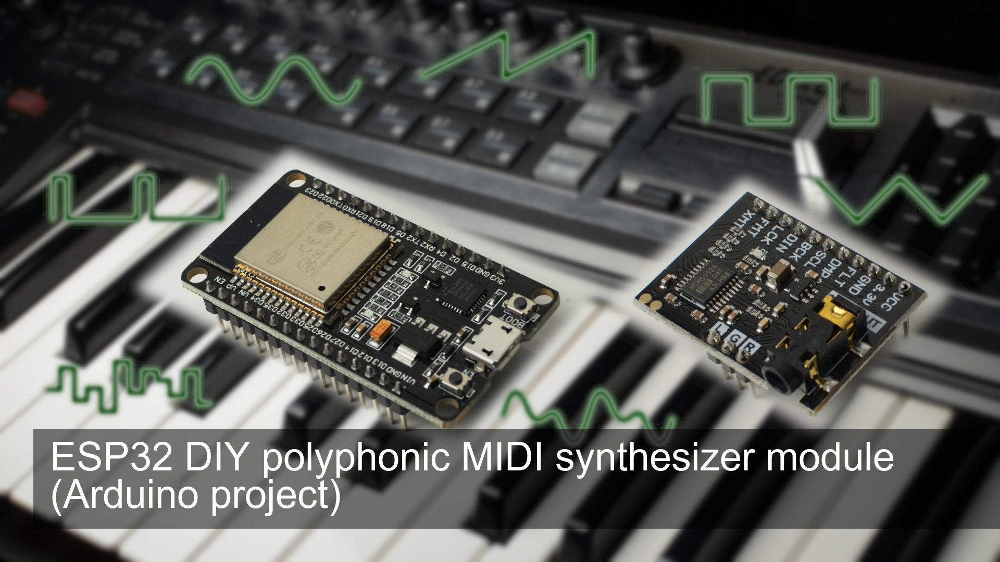

<h1 align="center">esp32_basic_synth</h1>
<h3 align="center">ESP32 based DIY polyphonic MIDI synthesizer module Arduino project</h3>  

 
   
  <a href="https://youtu.be/5XVK5MOKmZw">link to the video</a>

More infos:
- little quick start guide to get started with arduino synthesizer / music projects: https://youtu.be/ZNxGCB-d68g

---
The project has been tested on
- ESP32 Audio Kit V2.2 (using ESP32-A1S)
- ESP32 DEVKIT - DOIT (actually only supporting esp32\1.0.4 library)

# ESP32 Audio Kit V2.2
To compile set board to: ESP32 Dev Module
Ensure "#define ESP32_AUDIO_KIT" is set in config.h
IO22 will be used for MIDI in.

The ADC multiplexer can be used (other wise please remove #define ADC_TO_MIDI_ENABLED from config.h)
Connection of the ADC multiplexer:
- EN -> Ground
- S0 -> IO23
- S1 -> IO18
- S2 -> IO14
- S3 -> Ground
- Sig -> IO12

# ESP32 DEVKIT - DOIT
To compile set the board to: DOIT ESP32 DEVKIT V1
Ensure that "#define ESP32_AUDIO_KIT" has been removed from config.h

## Using a DAC
An external audio DAC is recommended for this setup:
- BCLK -> IO25
- WLCK -> IO27
- DOUT -> IO26

## Using no DAC
You can also get a sound without a DAC.
Add '#define I2S_NODAC' to config.h

The default output pin is IO22. Add a capacitor in series of the audio line (10µF for example)

## Using an ADC multiplexer
Connection of the ADC multiplexer:
- EN -> Ground
- S0 -> IO33
- S1 -> IO32
- S2 -> IO13
- S3 -> Ground
- Sig -> IO12
Here is the related video: https://youtu.be/l8GrNxElRkc

### ADC Mapping
The adc module has been only tested with the ESP32 Audio Kit V2.2.
In z_config.ino you can define your own mapping. Actually only 8 channels are read from the multiplexer.
The adc lookup is used to define a channel and cc per analog input (C0..C7).
By changing adc values a MIDI messages will generated internally.
It should be also mapped int the MIDI mapping.

# MIDI Mapping
A controller mapping can be found in z_config.ino.
You can define your own controller mapping if your controller does support CC messages.

## MIDI via USB
MIDI can be received via USB activating the MACRO "MIDI_VIA_USB_ENABLED" in config.h.

Default PIN Mapping is:
- CS: IO5
- INT: IO17 (not used)
- SCK: IO18
- MISO: IO19
- MOSI: IO23

For more information refer to the MIDI related project: https://github.com/marcel-licence/esp32_usb_midi
Using USB can be seen here: https://youtu.be/Mt3rT-SVZww

---
If you have questions or ideas please feel free to use the discussion area!

Derived projects 
---

MichaelPNolan added a phyicial interface, knobs etc. to make it standalone: https://github.com/MichaelPNolan/StandAloneSynth37key/tree/main/esp32_alone_synth
